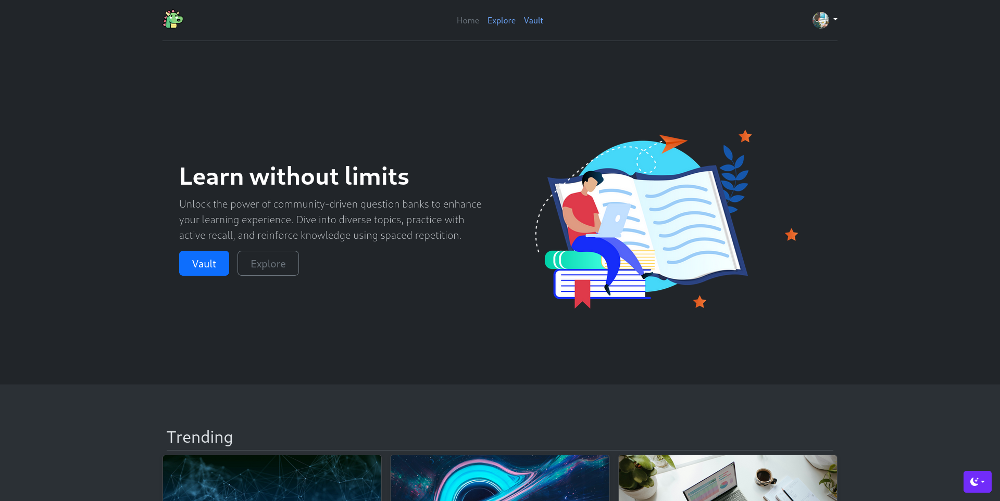
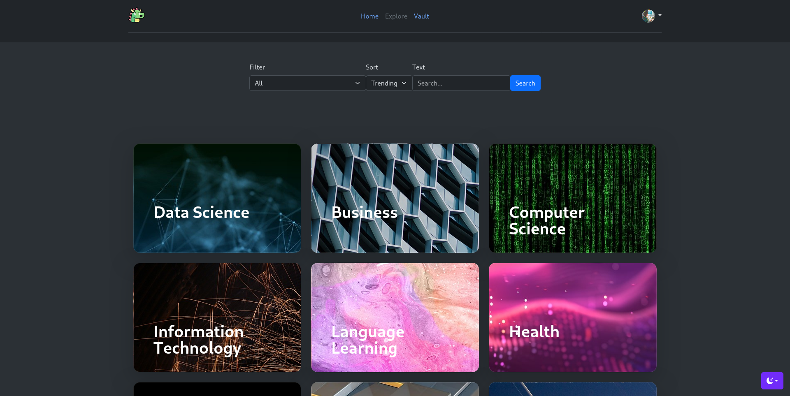
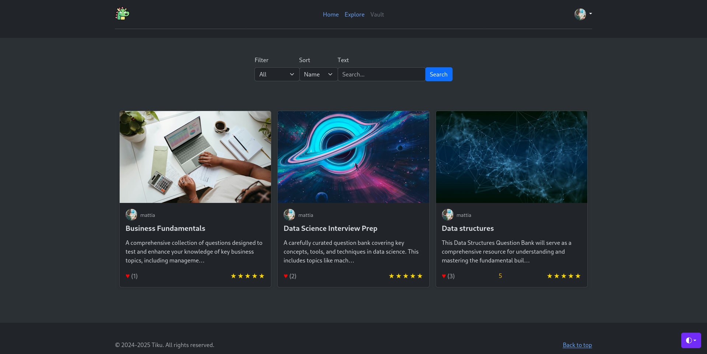
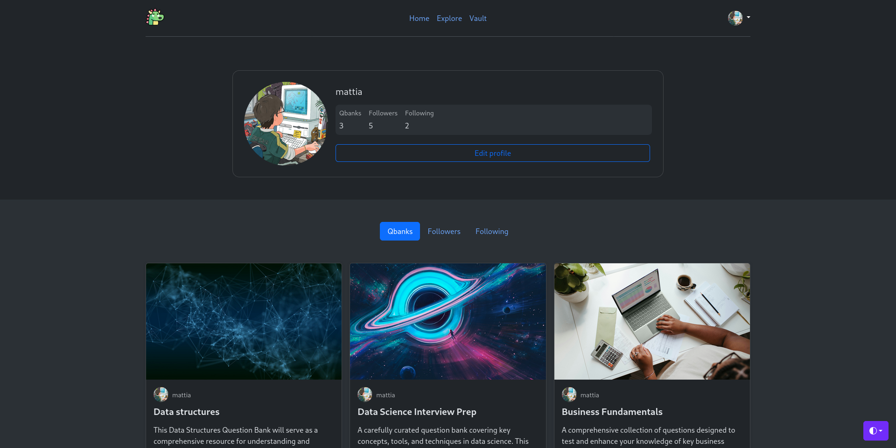
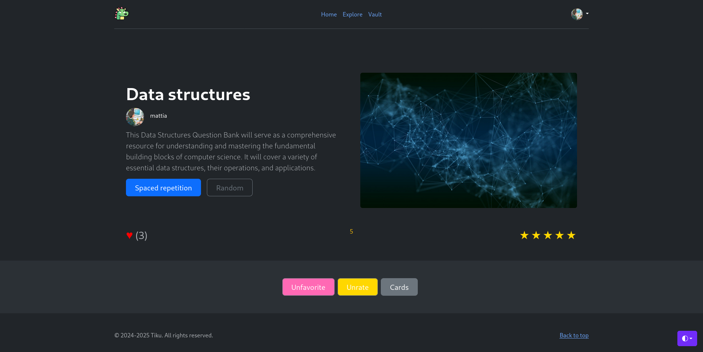
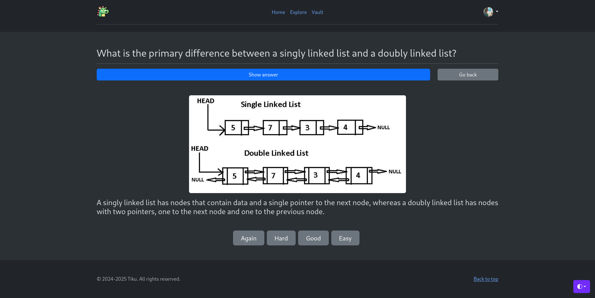

# Tiku
Tiku is a web app built with **Django** and **Bootstrap**, designed to host question banks for efficient learning using spaced repetition and active recall techniques. Users can create, practice, and explore question banks shared by others.
## About the project
Home page:

  
Explore page:

  
Vault page:

  
Profile page:

  
Qbank page:

  
Card page:

### Spaced repetition algorithm
The spaced repetition algorithm is a very simplified version of what softwares like Anki do: it adjusts the scheduling interval for reviewing a question based on the user's self-assessment of how well they answered it. The algorithm dynamically updates the review interval to optimize retention.

1. **Initial review**: When a question is first introduced, the review interval is set to 0 days (reviewed immediately)
2. **User rating categories**: After answering the question, the user rates their confidence in their answer using one of four options:
	- Again: Indicates the user found the question very difficult or forgot the answer
	- Hard: Indicates the user struggled but managed to recall part of the answer
	- Good: Indicates the user answered correctly with some effort
	- Easy: Indicates the user answered effortlessly and confidently
3. **Adjusting the interval**: Based on the rating, the review interval for the question is updated:
	- Again: The interval resets to 0 days (review the same day to reinforce)
	- Hard: The interval is halved, reducing the time until the next review
	- Good: The interval remains the same, keeping the current schedule
	- Easy: The interval is doubled, increasing the time until the next review
4. **Repeat process**: Each time the question is reviewed, the user rates it again, and the interval is updated dynamically
### Recommendation system
It comes with a basic recommendation system using user-based collaborative filtering.
User-based collaborative filtering methods predict the items that a user might like on the basis of ratings given to that item by other users who have similar taste with that of the target user.

The choice to use a user-based collaborative filtering was easy, because user ratings data was already available, and on the other hand qbanks are not characterized enough to differentiate them well using a content-based filtering method.
## Installation
1. Clone the repo and go in its directory:
```sh
git clone https://github.com/WJW02/tiku.git
cd tiku/
```

2. Install django inside a virtual environment:
```sh
pipenv install django
```

 3. Activate the virtual environment:
 ```sh
 pipenv shell
```

4. Install project dependencies:
```
pipenv install
```

5. Initialize database:
```sh
python3 manage.py makemigrations
python3 manage.py migrate
```

6. Create admin:
```
python3 manage.py createsuperuser
```

Optionally, if you care to use the superuser as normal user of the site, you need to manually create its associated account. Start the development server (see Usage section) and go to the admin page:
```
localhost:[port]/admin/
```

Then, go in the `Accounts` section to add a new account for the superuser (normal users automatically get an account by signing up though the standard form)

7. Create topics:

Start the development server (see Usage section) and go to the admin page:
```
localhost:[port]/admin/
```

Then, go in the `Topics` section to add a new topics. The base application expects the following topics to exist (case sensitive):
- Data Science
- Business
- Computer Science
- Personal Development
- Language Learning
- Information Technology
- Health
- Math and Logic
- Physical Science and Engineering
- Social Sciences
- Arts and Humanities
## Usage
1. In the root of the project, start the development server:
```sh
python3 manage.py runserver
```

2. Copy the `[IP]:[port]` on which the development server is hosted on a browser, e.g.:
```sh
localhost:8000
```
## Notes
Django `SECRET_KEY` is exposed in the code and `DEBUG` setting is set to `True`:
- These settings are not intended for production use
- Please be aware that exposing the `SECRET_KEY` and using `DEBUG = True` can make the application vulnerable to security risks
## Dependencies
| Package             | Version     |
| ------------------- | ----------- |
| asgiref             | 3.8.1       |
| crispy-bootstrap5   | 2024.10     |
| Django              | 5.1.5       |
| django-crispy-forms | 2.3         |
| joblib              | 1.4.2       |
| numpy               | 2.2.2       |
| pandas              | 2.2.3       |
| pillow              | 11.1.0      |
| python-dateutil     | 2.9.0.post0 |
| pytz                | 2024.2      |
| scikit-learn        | 1.6.1       |
| scipy               | 1.15.1      |
| six                 | 1.17.0      |
| sqlparse            | 0.5.3       |
| threadpoolctl       | 3.5.0       |
| tzdata              | 2025.1      |
